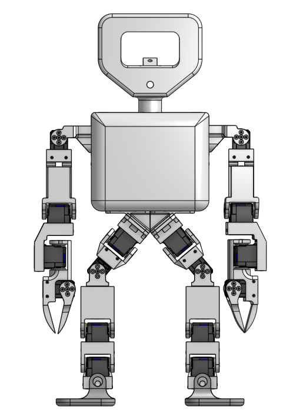

# Vibe Robotics SDK

The Vibe Robotics SDK is a Python package that provides a simple and developer-friendly interface for controlling Vibe Robotics platforms. It enables developers to access robot states, send control commands, and build applications for robotics research, education, and embodied AI development.

## Installation


```bash
conda create -n vibe python=3.10
conda activate vibe
conda install -c conda-forge pinocchio=3.9.0
pip install -r requirements.txt
pip install -e .
```

## Requirements

- Python 3.10
- See `requirements.txt` and `environment.yml` for full dependency lists


## Setting up the robot

### Calibration

Place the robot in the standing position shown below, then run:



```bash
python scripts/calibrate.py
```

The script will prompt you for motor IDs to zero (comma-separated). Press Enter to zero all motors.

### PD Stand

Drives the robot to the default standing pose using a PD controller. Run after calibration to verify the configuration before walking.

```bash
python scripts/pd_stand.py
```

# Walking

This document covers how to run the walking scripts and how walking is implemented. All scripts are located under `scripts/walking/`. The main script for development is `robot.py`; the full hardware demo script is `demo.py`.

## Visualization

The visualizer is useful for development — it shows the joint angle commands from the walking controller with no physics. Connect a joystick and run:

```bash
python scripts/walking/robot.py --mode view
```

## Simulation

Test the walking controller in MuJoCo simulation:

```bash
python scripts/walking/robot.py --mode simulate
```

## Real World Demo

### Prerequisites

Activate the conda environment:
```bash
conda activate vibe
```

Make sure the laptop and the Raspberry Pi are connected to the same network.

### Hardware Setup

Perform these steps in order:

1. Connect the leg motor controller to the Raspberry Pi
2. Connect the arm motor controller to the Raspberry Pi
3. On the Raspberry Pi, run:
   ```bash
   python scripts/run_receiver.py
   ```
4. Connect a joystick controller to your laptop
5. (Optional) To enable teleoperation, connect the leader robot to the laptop
6. Get the Raspberry Pi's IP address with `ip addr`
7. On the laptop, run:
   ```bash
   python scripts/walking/demo.py --remote --host <raspberry pi ip>
   ```
   Add `--teleop` to enable teleoperation.
8. Press Enter when you see `start>`

### Controls

| Button | Action |
|---|---|
| START | Start walking |
| A | Wave hand |
| B | Lay down. Press X to end the demo, or START to stand back up and resume walking |
| Y | Teleoperation mode (press START to exit) |
| Left joystick | XY linear velocity |
| Right joystick | Yaw rate |

## Implementation

### File Overview

| File | Description |
|---|---|
| `classes.py` | Core data classes: `WalkState`, `SE3`, `Footstep`, `Foot`, `PointMass`, `Stance`, `IKTarget`, configs |
| `generate_footsteps.py` | `FootstepGenerator` — computes the next footstep from joystick commands |
| `mpc.py` | Generic QP-based linear MPC solver (`LinearPredictiveControl`) |
| `fsm.py` | `WalkingFSM` — the main walking controller; integrates ZMP model, MPC, and swing-foot trajectory |
| `interp.py` | `CubicHermiteInterpolation` — swing foot trajectory via cubic Hermite splines |
| `robot.py` | `Robot` class — IK solver, visualization, simulation, and deployment |
| `demo.py` | `Demo` class — joystick-driven state machine for the full hardware demo |
| `remote.py` | `NumpySocket` — TCP transport for streaming joint angles to the Raspberry Pi |
| `viser_vis.py` | `ViserVisualizer` — 3D visualization using Viser |

---

### Footstep Generation

**`generate_footsteps.py` — `FootstepGenerator`**

`FootstepGenerator` maintains a reference position `(ref_x, ref_y)` and heading `ref_theta` representing the robot's locomotion frame. On each step it receives a joystick command `[fwd, lat, yaw]` (each in `[-1, 1]`) and computes the next footstep:

1. `ref_theta` is incremented by `yaw * steering_strength` (default ≈5°/step).
2. The reference point advances by `fwd * step_length` along the current heading and `lat * step_length` laterally.
3. The swing foot is placed at `±foot_spread` from the reference point laterally (sign depends on which foot is swinging).
4. The footstep is returned as an SE3 transform encoding position and heading.

---

### ZMP Model

**`fsm.py` — `update_mpc`**

The COM is modeled as a **Linear Inverted Pendulum** (jerk-integrator). The state at each timestep is `x = [position, velocity, acceleration]` and the control input is jerk. The discrete dynamics are:

```
x_{k+1} = A x_k + B u_k
```

with `A` and `B` derived from the constant-height assumption. The **Zero Moment Point** (ZMP) is related to the state by:

```
zmp = position - (h / g) * acceleration
```

where `h` is the COM height and `g = 9.81`. The ZMP must remain inside the support polygon at all times, forming the linear inequality constraints for the MPC.

COM state is integrated forward each tick using `PointMass.integrate_constant_jerk`.

---

### MPC

**`mpc.py` — `LinearPredictiveControl`**

A generic single-shooting QP-based MPC that minimizes a weighted sum of:
- **Terminal state error**: `||x_N - x_goal||²` (weight `wxt`)
- **Running state error**: `Σ ||x_k - x_goal||²` (weight `wxc`)
- **Control cost**: `Σ ||u_k||²` (weight `wu`, for regularization)

Subject to linear constraints `C x_k + D u_k ≤ e_k`. The QP is built by unrolling the dynamics into a single matrix equation and solved using OSQP.

**`fsm.py` — `update_mpc`**

Two independent MPC instances are solved per update — one for the **forward** axis and one for the **lateral** axis — both in a heading-aligned local frame `(f, l)`. This ensures ZMP constraints rotate correctly with the robot's heading.

ZMP bounds are scheduled over the preview window of 10 steps based on the gait phase:
- **Current DSP**: unconstrained (large bounds)
- **SSP**: bounded to the stance foot's contact area (scaled to 80%)
- **Next DSP**: unconstrained
- **Next SSP**: bounded to the swing foot's contact area (next footstep target)

The MPC is re-solved every 3 control ticks. Between solves, the first jerk command from the current plan is applied and the COM is integrated forward.

---

### Swing Foot Trajectory

**`interp.py` — `CubicHermiteInterpolation`**

The swing foot follows a cubic Hermite spline from its current pose to the next footstep target. Tangent magnitudes `λ` (takeoff) and `μ` (landing) are solved once via a small QP that enforces minimum ground clearance at `s=0.25` and `s=0.75` along the trajectory. Rotation is interpolated via SLERP. The trajectory advances by calling `integrate(dt)` each tick.

---

### Finite State Machine

**`fsm.py` — `WalkingFSM`**

The FSM has three states:

- **STAND**: idle; waits for a nonzero joystick command before transitioning to DSP.
- **DSP** (double support phase): both feet on the ground; COM shifts toward the upcoming stance foot via MPC. Transitions to SSP when the phase timer expires.
- **SSP** (single support phase): one foot swings to the next target while COM continues to be driven by MPC. Transitions back to DSP (or STAND if the command is zero) when the phase timer expires.

Each call to `on_tick()` advances the active phase by `dt=0.03s`, integrating the COM and updating the swing foot pose.

---

### Inverse Kinematics

**`robot.py` — `Robot.ik`**

Given an `IKTarget` (desired left foot pose, right foot pose, COM position, and heading), joint angles are solved iteratively using **damped least-squares IK** (Levenberg–Marquardt style) via Pinocchio:

1. Forward kinematics and COM are computed at the current `q`.
2. Errors are computed for: left/right foot position and orientation, COM position, and base yaw.
3. A stacked Jacobian is assembled for all tasks. Translational errors are expressed in the base frame to remain translation-invariant.
4. The joint update is `dq = Jᵀ (J Jᵀ + α²I)⁻¹ e` with damping `α=0.03` and step size `0.05`.
5. Iteration stops when `||e|| < tol` or `max_iters` is reached.

The COM target is post-processed in `_get_targets()` to scale the lateral COM displacement relative to the midfoot, preventing excessive lateral lean.
